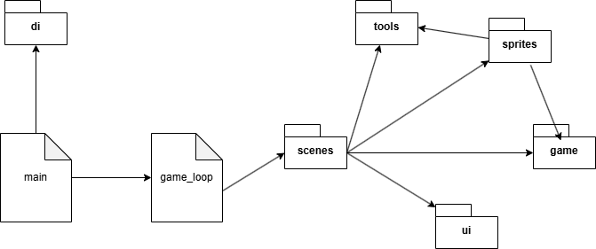
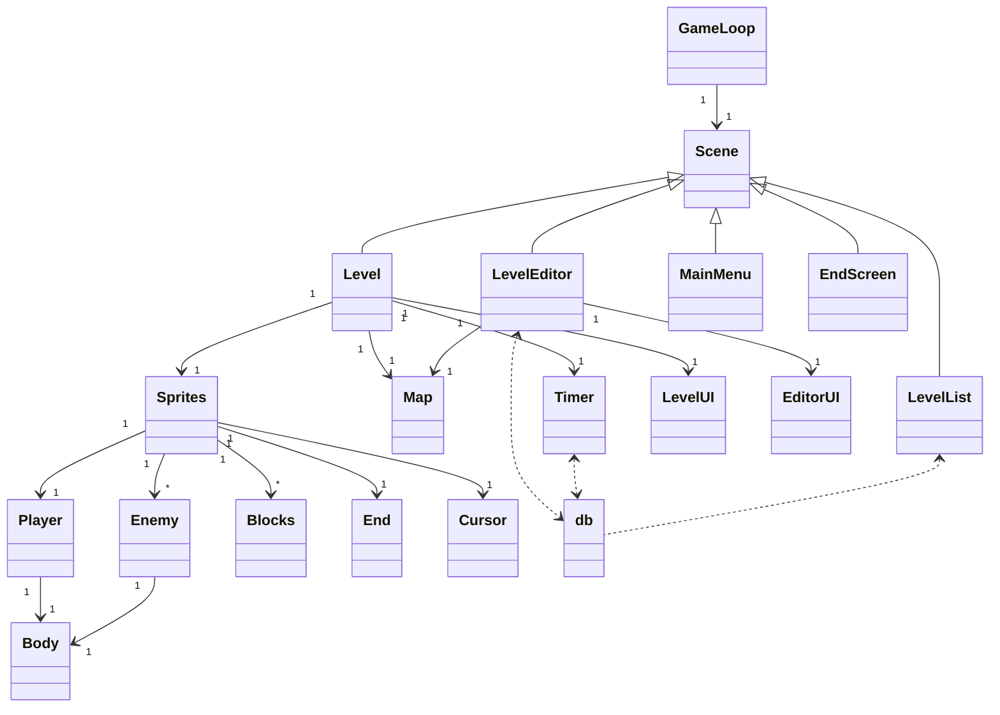
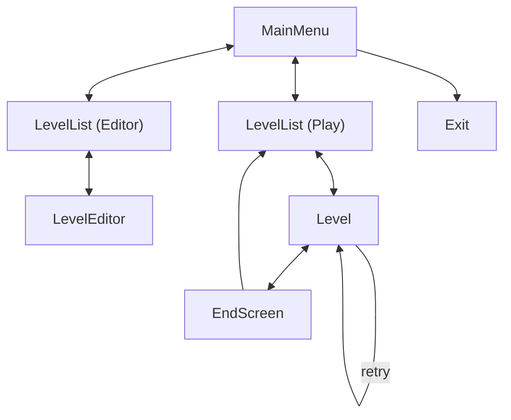
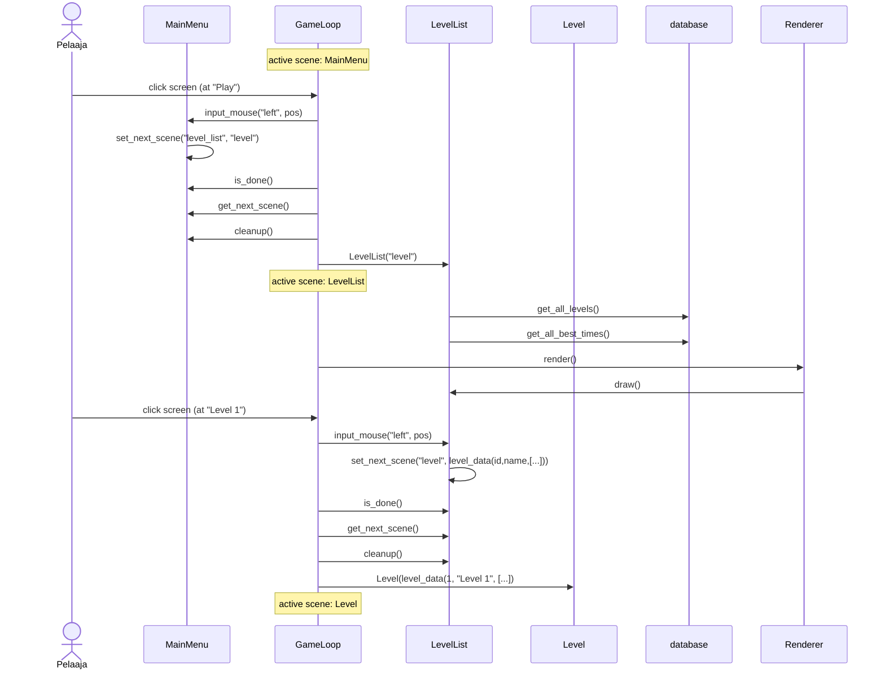

# Arkkitehtuurikuvaus

## Pakkausrakenne

**wrappers** sisältää pygame riippuvuuksien injektointia varten liittyvät luokat. (ennen, "di": "dependency injection")

**game** sisältää aktiivisen pelin aikana käytettäviä luokkia joille ei ole omaa kategoriaa.

**sprites** kaikki pelin objectit jotka voivat näkyä ruudulla.

**ui** käyttöliittymään liittyvät luokat.

**scenes** sisältää kaikki sovelluksen eri tilat. Yksi scene yhdistää kaikki tilassa tarvittavan logiikan ja käyttöliittymän

**tools** hyödyllisiä yksittäisiä funktioita ja tietokannan käsittely.

## Luokkakaavio

## Käyttöliittymä
Kulku sovelluksen tiloissa:

## Sekvenssikaaviot
Pelin aloitus

