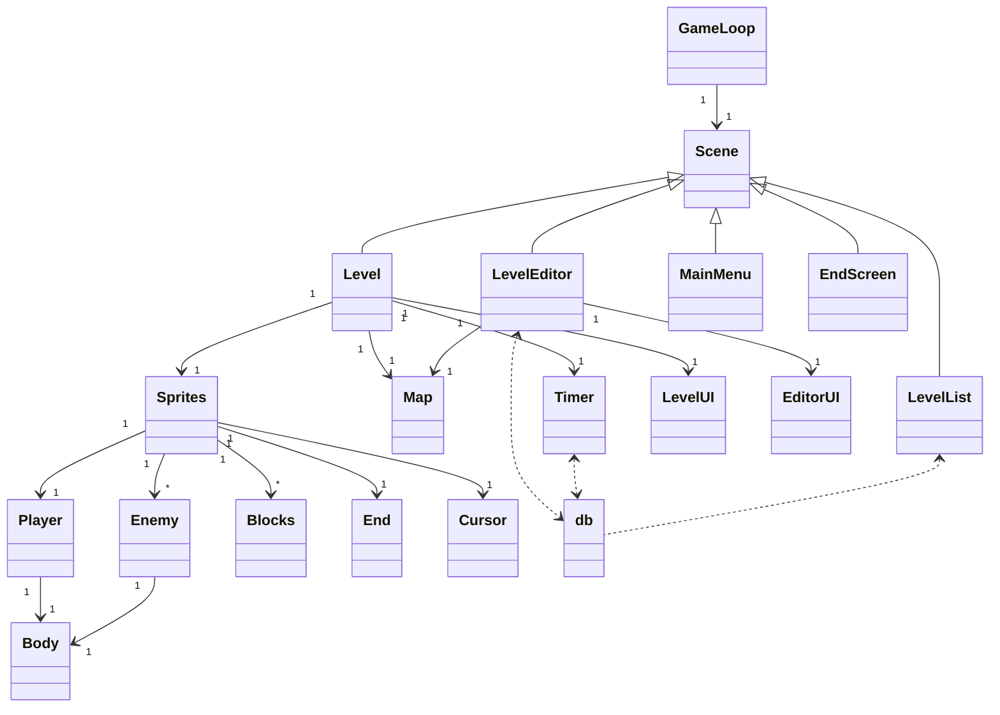
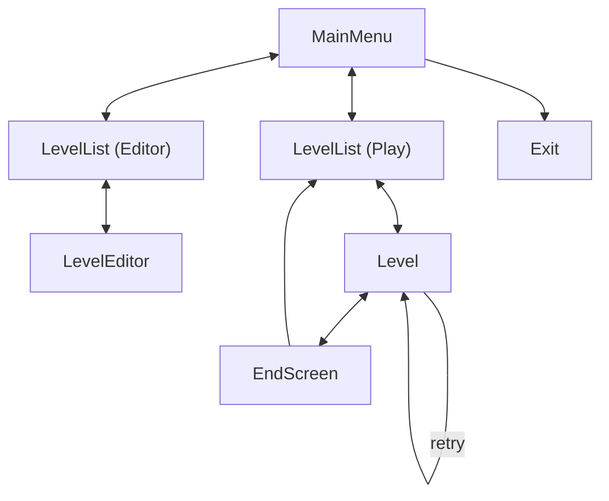
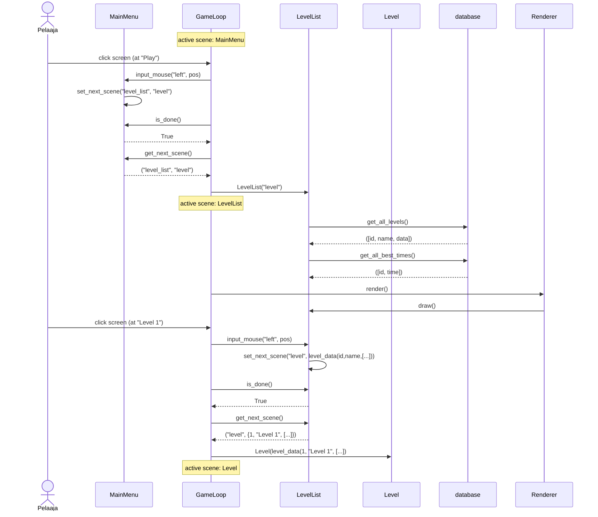

# Arkkitehtuurikuvaus

## Pakkausrakenne

**wrappers** sisältää pygame riippuvuuksien injektointia varten liittyvät luokat. (ennen, "di": "dependency injection"). Ei kovin merkityksellinen osa projektia.

Esimerkki sisältö: `clock.py`, `renderer.py`

**game** sisältää pelilogiikkaan liittyvät luokat, kuten fysiikat, animaatiot, tasojen tietorakenteet ja niiden käsittelyyn käytettävät osat. Näitä käytetään aktiivisesti pelin aikana.

Esimerkki sisältö: `map.py`, `body.py`, `sprite_animation.py`

**sprites** sisältää kaikki pelin sprite luokat. Kaikki oliot joilla on sijainti pelimaailmassa ja näkyvä komponentti kuuluvat tänne.

Esimerkki sisältö: `player.py`, `enemy.py`, `block.py`

**ui** kaikki käyttöliittymään liittyvät luokat, kuten LevelUI, EditorUI ja yksittäiset komponentit.

Esimerkki sisältö: `button.py`, `confirm_box.py`, `level_ui.py`

**scenes** sisältää kaikki sovelluksen eri tilat. Yksi scene yhdistää kaikki tilassa tarvittavan logiikan ja käyttöliittymän.

Esimerkki sisältö: `main_menu.py`, `level.py`, `end_screen.py`

**tools** hyödyllisiä yksittäisiä funktioita, pieniä luokkia ja esim. tietokannan käsittely.

Esimerkki sisältö: `asset_helpers.py`, `db.py`, `font_manager.py`

## Yleistä tietoa

Sovellus rakentuu itsenäisistä scene-luokista, joista kukin vastaa yhden sovelluksen tilan (esim. päävalikko, editori) hallinnasta.
GameLoop-luokka hallinnoi aktiivista sceneä ja vaihtaa scenejä, kun scene ilmoittaa olevansa valmis.
Scene-luokat käyttävät tarvittaessa apuluokkia oman tilansa piirtämiseen, pelaajan syötteiden käsittelyyn ja logiikan toteuttamiseen omassa tilassaan.
Tietokantaan tallennetaan esimerkiksi kenttien ja aikojen tiedot.
Pelissä näkyvät oliot (kuten pelaaja, vihollinen ja palikat) ovat kaikki sprites-kansion Sprite-olioita ja tarvittaessa käyttävät Body-luokkaa liikkumista ja muita fysiikoita varten.

### Esimerkki tiedon kulkemisesta

- Käyttäjän syötteet (näppäimistö, hiiri) välitetään GameLoopin kautta aktiiviselle Scene-oliolle.
- Scene käsittelee syötteet ja päivittää logiikkaa, esim. liikuttaa pelaajaa, lisää palikoita kenttään.
- Renderer piirtää ruudulle aktiivisen Scene-olion tarjoaman näkymän sen draw-metodin avulla.
- Kun Scene haluaa siirtyä seuraavaan tilaan, esim. päävalikosta tasolistaan, GameLoop vaihtaa aktiivisen Scene-olion.
- Tietokantaa käytetään tasojen ja aikojen hakemiseen.

## Luokkakaavio

Alla oleva luokkakaavio kuvaa sovelluksen keskeisten luokkien suhteet toisiinsa.
Scene-luokat perivät yhteisen Scene-pohjaluokan ja hallitsevat oman tilansa logiikkaa ja näkymää.
Lisäksi näkyvät tärkeimmät pelioliot ja niiden suhteet, kuten esim: Player ja Enemy, joilla molemmilla on Body liikkumista varten.

## Käyttöliittymä

Tämä kuvaa sovelluksen tilojen eli Scenejen välistä siirtymistä käyttäjän toiminnan perusteella.
Käyttäjä voi liikkua päävalikosta editoriin, tasolistaan, yksittäiseen tasoon ja tason suoritettua lopetustilaan.
Tilojen välillä liikkuminen tapahtuu aina aktiivisen Scene-olion kautta.

## Sekvenssikaaviot
Alla oleva kaavio kuvaa tyypillisen pelin aloitusprosessin tapahtumaketjun.
Se näyttää kuinka pelaajan syöte välittyy aktiiviselle Scene-oliolle, ja kuinka Scene vaihtuu taustalla GameLoopin ohjaamana.
Lisäksi kuvataan kuinka tietokantaa hyödynnetään tason tietojen hakemisessa ja kuinka Renderer vastaa piirtämisestä.

