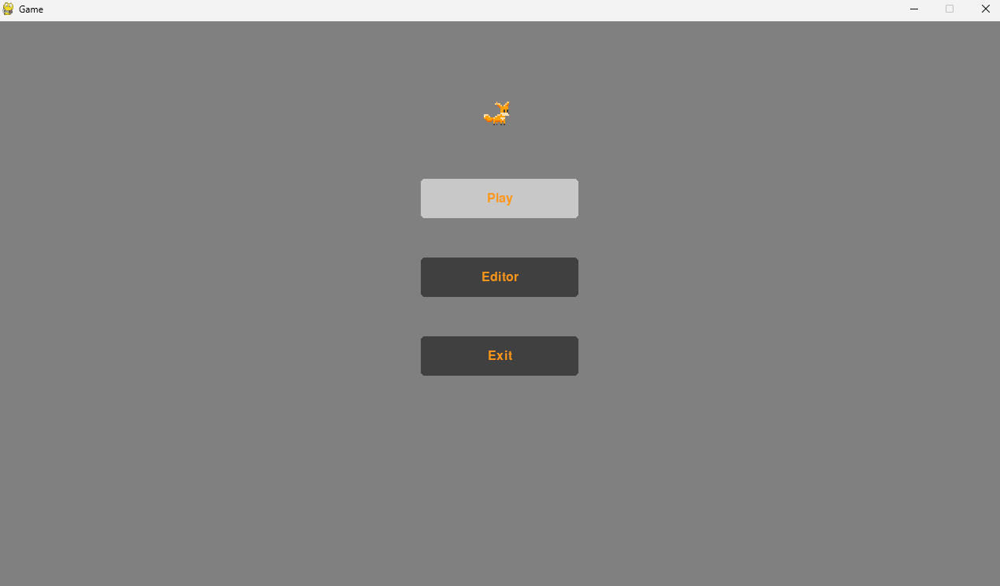
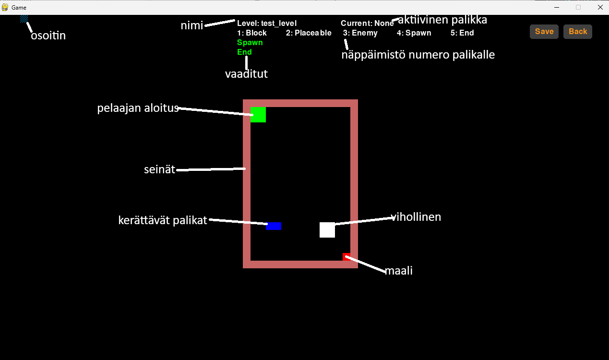

# Käyttöohje

Lataa uusin release [tästä linkistä](https://github.com/Zediyo/ot-harjoitustyo/releases).

## Ohjelman käynnistys

Varmista että koneellasi on python 3.10 tai uudempi ja poetry asennettuna.

Ensimmäisellä kerralla suoritä seuraava komento juurikansiossa.

```bash
poetry install
```

Nyt voit käynnistää pelin suorittamalla komennon

```bash
poetry run invoke start
```

## Ohjaimet

### Pelissä
- **W / Space** - Hyppää
- **A / D** - Liiku vasemmalle tai oikealle
- **Hiiren vasen painike** - Lisää palikka kentälle (jos palikoita jäljellä)
- **Hiiren oikea painike** - Poista palikka kentältä (jos tarpeeksi lähellä)

## Editorissa
- **Numerot 1-6** - Valitse lisättävä laatta
- **Hiiren vasen painike** - Lisää valittu laatta (jos salittu määrä ei ylity ja laatalle on tilaa)
- **Hiiren oikea painike** - Poista laatta osoittimen alta

## Pelin aloittaminen, pelitila ja lopetus

Käynnistämisen jälkeen olet aloitusruudussa. Valitse "Play".



Nyt olet pelitilan tasovalikossa. Valitse taso jota haluat pelata tai "Back" jos haluat siirtyä takaisin edelliseen näkymään.
Tasojen nimi näkyy napissa josta siirryt pelitilaan. Nimen yläpuolella näkyy joko vihreällä nopein suoritusaika tasossa tai punaisella "--:--" jos tasossa ei ole suoritusta vielä. Jos tasoja on enemmän kuin mahtuu kerralla ruudulle voit vierittää listaa käyttämällä hiiren rullaa.


Pelissä on punaisia palikoita joiden läpi ei voi kulkea, sinisiä palkoita joita voit kerätä ja asettaa kentälle hiiren vasemmalla ja oikealla näppäimellä.
Viholliseen osuessa taso alkaa alusta ja maaliin päästyä peli päättyy.
Ylhäällä näet myös tason nimen, kuinka monta palikkaa sinulla on käytettävissä ja suorituksen ajan.
Back nappulasta pääset takaisin tasolistaan.


Maaliin päästyä olet lopetusruudussa jossa voit palata takaisin tasolistaan tai pelata saman tason uudestaan.
Keskellä näet myös tason suorituksen ajan ja parhaan ajan.


## Editorin tasolista ja editorin käyttö

Valitse aloitusruudusta "Editor".

Tasolista on hyvin samanlainen kuin pelitilassa. Jokaisen tason kohdalla näkyy vihreällä nimi, sen alapuolella on "Delete" nappula joka poistaa tason. "Clear Times" nappi näkyy jos tasossa on suorituksia ja sitä painamalla poistat kaikki suoritukset tasosta. Edit nappula siirtyy editori tilaan.

Uuden tason luonti tapahtuu oikealla ylhäällä olevasta tekstikentästä ja "Create Level" napista. Kirjoita uuden tason nimi ja jos se on uniikki, painamalla enter näppäimistöstä tai hiirellä "Create Level" nappia siirryt editori tilaan.

Back napilla pääset takaisin aloitusruutuun.


Delete ja Clear Times nappulat varmistavat että haluat suorittaa toiminnon.


Editorissa voit näppäimistön numerolla valita haluamasi palikan ja asettaa sen kentälle hiiren vasemmalla napilla tai poistaa hiiren oikealla napilla. Jokainen taso vaatii että siinä on aloitus ruutu ja lopetus ruutu, tämä näkyy keskellä ylhäällä joko vihreällä tai punaisella. "Save" nappia voit painaa vain jos vaaditut palikat on kentällä, painon jälkeen taso tallentuu. Back napista pääset takaisin tallentamatta muutoksia.


