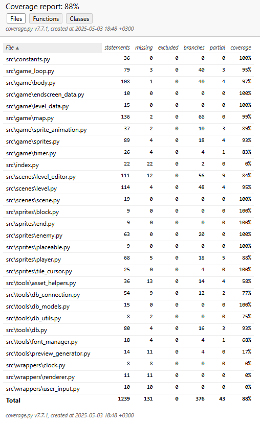

# Testausdokumentti

Tässä dokumentissa kuvataan projektin automaattinen testaus, testikattavuus ja manuaalinen testaus.

## Automaattinen testaus

Testit sijaitsevat[/src/tests/](https://github.com/Zediyo/ot-harjoitustyo/tree/main/src/tests) kansiossa.

### `db_test.py`
Testaa toiminnot käyttämällä muistipohjaista tietokantaa.

Testaa:
- Tietokanta luodaan oikeassa muodossa.
- Suoritus aikojen lataaminen ja tallennus (myös virheellisillä syötteillä)
- Tasojen tallennus ja lataaminen (myös virheellisillä syötteillä)
- Kaikkien tasojen ja aikojen joukko hakeminen.
- Tason nimi on jo olemassa.
- Aikojen ja tasojen poisto.

### `enemy_test.py`
Testaa `Enemy` sprite luokkaa ja sen käyttämää body luokkaa.

Testaa:
- Luominen tapahtuu oikein.
- Update kutsun kautta testataan.
  - Vihollinen liikkuu ja päivittyy.
  - Seiniin törmääminen (Body luokan avulla)
  - Suunnan vaihto törmäämisen jälkee.
  - Hyppää törmäys kriteerit täytettyä.
  - Hyppää pelaajaa päin oikeissa olosuhteissa.

### `player_test.py`
Testaa `Player` sprite luokkaa ja body luokkaa ja sen fysiikoita.

Testaa:
- Luominen tapahtuu oikein.
- add_input toimii.
- move ja add_input avulla testataan. (käyttävät body luokkaa)
  - Liikkuminen toimii oikein.
  - Painovoima toimii oikein. 
  - Pystysuora liikkuminen ja törmääminen toimii.
  - Vaakasuora liikkuminen ja törmääminen toimii.
  - Hyppiminen toimii oikein.

### `map_test.py`
Testaa `Map` luokan toiminnot.

Testaa:
- Alkutila oikein.
- Piste kartan sisällä. (myös reunatapaukset ja virheelliset syötteet)
- Koordinaatisto muunnokset solujen, ruudun ja maailman välillä.
- Kartan kasvatus ja pienennys.
- Yksittäisen solun käsittely. (poisto, haku, asetus)
- Useamman solun käsittely. (monen solun laatta), (poisto, haku, asetus, reunan etsintä)
- Virheellisellä syötteellä yhden ja useamman solun operaatiot.

### `level_test.py`
Testaa `Level` scene luokkaa.

Testaa:
- Alkutila oikein.
- Liikkumisen syötteet siirtyvät player luokalle oikein.
- Hiiren painallukset toimivat.
  - Lisää palikan kentälle oikein. (tilaa, ei kaukana, palikoita jäljellä, kentän sisällä)
  - Poistaa palikan kentältä oikein. (poistettava pala, ei kaukana, lisää reppuun)
- Pelaajan ja vihollisten välinen törmääminen toimii ja peli alkaa alusta jos törmäys tapahtuu.
- Pelaajan ja maalin välinen törmääminen toimii ja peli siirtyy lopetus ruutuus jos törmäys tapahtuu.
- Jos pelaaja putoaa kentän ulkopuolelle kenttä alkaa alusta.
- Jos vihollinen putoaa kentän ulkopuolle ne poistetaan pelistä.

### `level_editor_test.py`
Testaa `LevelEditor` scene luokkaa.

Testaa:
- Lisää ja poista jokainen palikka niiden omien sääntöjen mukaisesti.
- Poista monen solun laatta eri kohdista.

### `game_loop_test.py`
Testaa `GameLoop` luokan toiminnan ja yleisesti pelin pyörimisen usean eri luokan kautta.

Testaa:
- Syötöt, päivitykset, piirrot, scenen vaihdot ja puhdistus tapahtuvat oikean ja oikeassa järjestyksessä.
- Pelin sammutus toimii oikein.
- Scenejen vaihdot viallisilla syötteillä.
- Aloitusruutuun vaihto.
- Tasolistaan vaihto.
- Pelitilaan vaihto.
- Pelitilan kulku, maaliin päätyminen ja lopetusruutuun vaihtuminen.
- Editoriin vaihto.

## Testauskattavuus

Kattavuusprosentti ilman käyttöliittymää on 88%

## Manuaalinen testaus

Sovellus on testattu manuaalisesti kokonaan. (Windows ja Linux koneilla.)
Lista testatuista asioista:

- Asset kansiosta puuttuvat tiedostot eivät kaada ohjelmaa ja käyttävät generoitua kuvaa.
- preview_generator luo oikean kuvan tasolistoissa ja editorissa.

### Aloitusruutu
- 3 nappin toiminto, sijainta + idle animaatio
### Tasolista (peliin)
- Rulla toimii jos yli 4 karttaa pelissä, staattinen jos alle
- Back nappula toimii
- Ajat näkyvät vihreällä jos olemassa punaisella jos ei
- Tason nimi oikein ja nappi siirtyy tasoon
### Tasolista (editoriin)
- Rulla toimii jos yli 4 karttaa pelissä, staattinen jos alle
- Back nappula toimii
- Delete nappula avaa varmistuksen ja toimii
- Clear times avaa varmistuksen ja näkyy vain jos aika olemassa
- Tasojen nimet oikein
- Edit nappula oikein ja siirtyy editoriin
- Create level ja tekstikenttä, tarkistaa rajoitteet (pituus, olemassaolo), enter painike tai nappi siirtyy uuden tason editoriin.
### Peli
- Näppäimistön syötteet liikuttavat hahmoa odotetulla tavalla
- Törmäykset seiniin, vihollisiin, maaliin
- Painovoima, hyppy ja putoaminen
- Palikoiden poisto ja lisäys, (nopeasti, päällekkäin, liian kauas, kentän ulkopuolelle)
- Animaatiot oikein
- Tason nimi, palikoiden määrä, paras aika ja aika
- Back nappula toimii
### Lopetusruutu
- Paras aika ja suoritus aika (kentässä ei aikaa ennen, huonompi aika, parempi aika)
- Retry ja Menu napit
### Editori
- Käyttöliittymä tiedot oikein
- Alku ja maali tiedot ja rajoitukset oikein
- Laattojen lisääminen (nopeasti, päällekkäin, kulmista, eri kokoisia)
- Laattojen poistaminen (jokaisesta yksittäisestä solusta)
- Tallentaminen (ei näy ilman alku + loppua, uusi kartta, olemassa oleva, ei muutoksia)
- Back toimii eikä muutokset säily

## Puutteet
- Automaattiset testit eri painikkeiden toiminnoille.
- Sprite kuvapohjan olemassaolo tarkitus tai testaus.
- Automaattinen animaatoiden toimisen testaus.
- Peliruudun koon vaihtaminen.
- Tuhansien tasojen lisäys saattaa aiheuttaa ongelmia.
- Ei lokitiedostoa mahdollisille tietokanta virheille tai muille.
- Ei testattu wrappers kansion tiedostoja tai index.